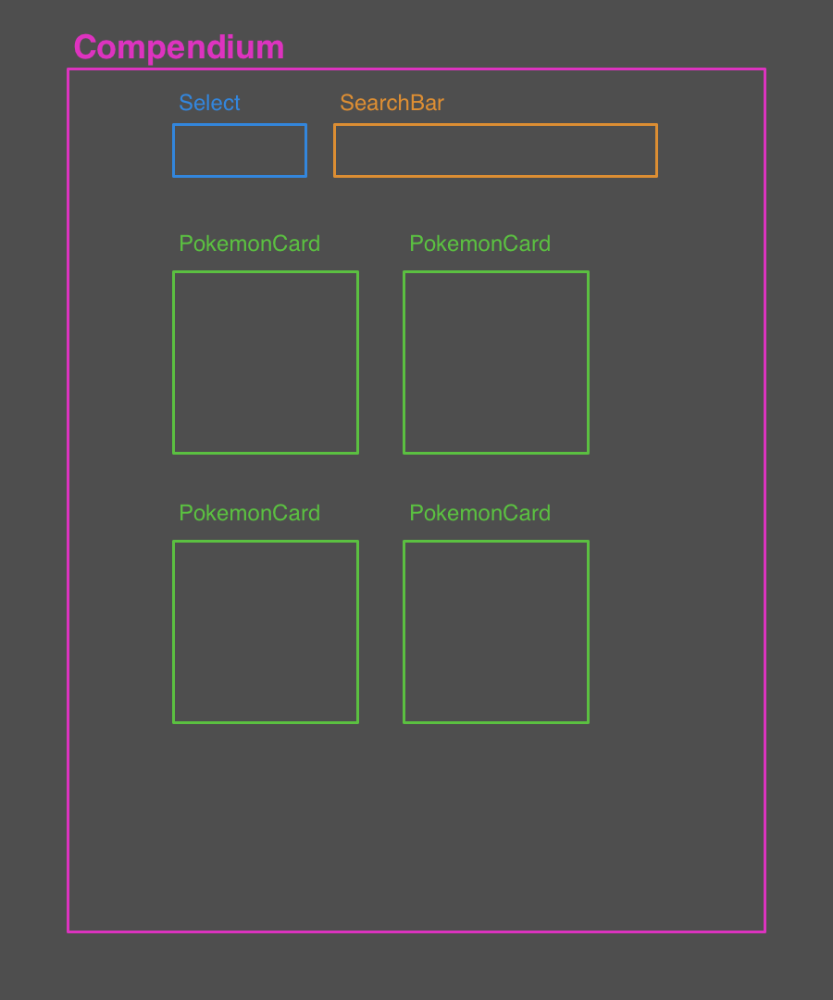

# Pokemon Compendium Plan

## Components

- `Compendium`: The main component.
- `Select`: a generic dropdown component
- `SearchBar`: a generic search bar component
- `PokemonCard`: displays a single pokemon with details

## Wireframe

## State

- `pokemon`: loaded from API
- `types`: loaded from API
- `loading`: set to true whenever a pokemon fetch effect is in progress.
- `selectedType`: controlled by Select component
- `searchQuery`: controlled by SearchBar component

## Events

- On first render: fetch a list of pokemon without a type or name query.
- On select changed: `setSelectedType` (`selectedType` will be dependency of our pokemon fetching effect).
- On search bar submit: `setSearchQuery` (`searchQuery` will trigger our pokemon fetching effect as well).

## Plan

1. Make `fetchPokemon` service function.
   - first iteration won't have any search params
2. Write `usePokemon` hook
   - first iteration will only fetch the pokemon with a `useEffect` hook.
3. Make a `Compendium` component.
4. Make a `PokemonCard` component.
5. Add type filtering.
6. Add name searching.
7. Style it.
